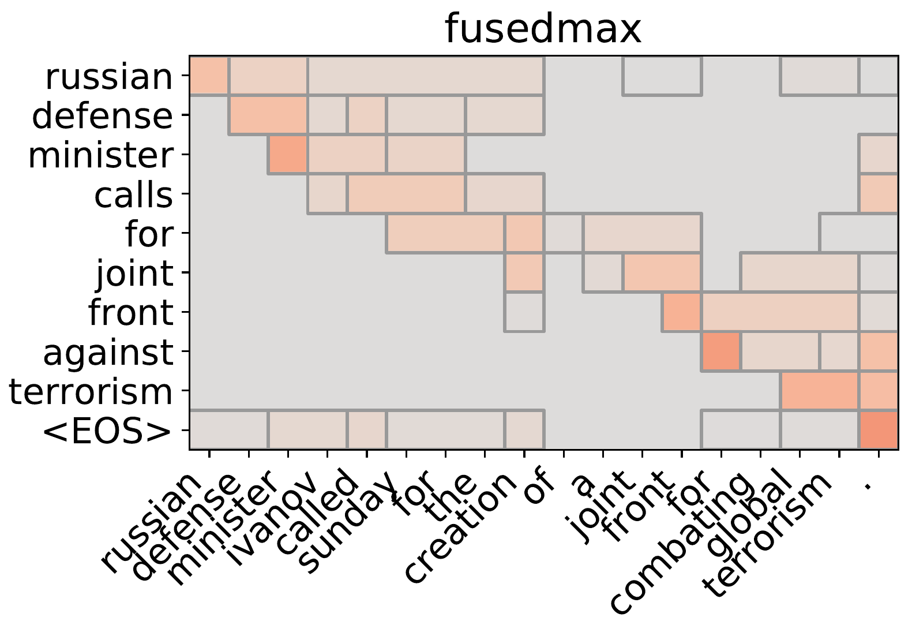

# Sparse and structured attention mechanisms

--------------------------------------------------------------------------------

Efficient implementation of structured sparsity inducing
attention mechanisms: fusedmax, oscarmax and sparsemax.

**Note**: If you are just looking for sparsemax, I recommend the implementation in [this OpenNMT-py module](https://github.com/OpenNMT/OpenNMT-py/blob/master/onmt/modules/sparse_activations.py#L41)

Currently available for pytorch v0.2. Requires python
(3.6, 3.5, or 2.7), cython, numpy, scipy, scikit-learn,
and [lightning](http://contrib.scikit-learn.org/lightning/).

For details, check out our paper:

> Vlad Niculae and Mathieu Blondel
> A Regularized Framework for Sparse and Structured Neural Attention
> In: Proceedings of NIPS, 2017. 
> https://arxiv.org/abs/1705.07704 

See also:

> André F. T. Martins and Ramón Fernandez Astudillo
> From Softmax to Sparsemax: A Sparse Model of Attention and Multi-Label Classification
> In: Proceedings of ICML, 2016
> https://arxiv.org/abs/1602.02068

> X. Zeng and M. Figueiredo,
> The ordered weighted L1 norm: Atomic formulation, dual norm, and projections.
> eprint http://arxiv.org/abs/1409.4271

